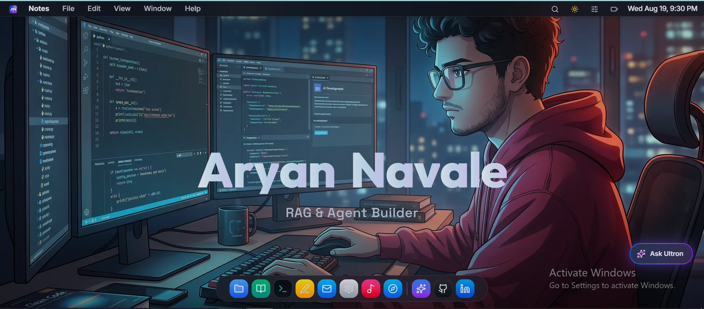
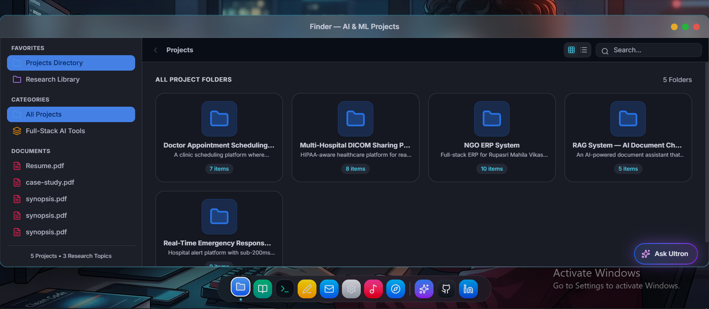
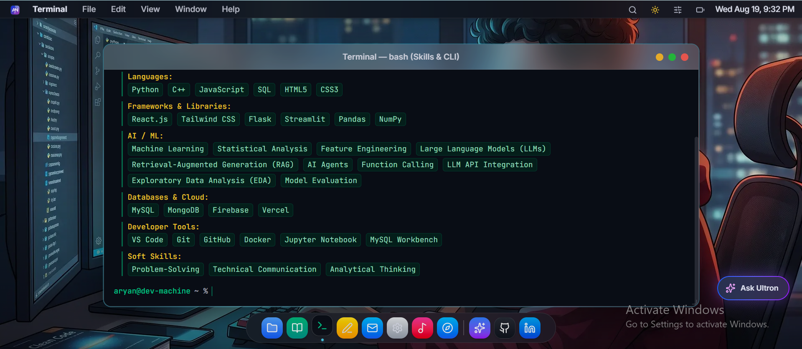
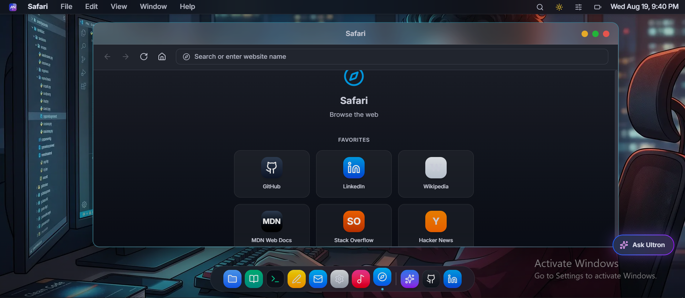
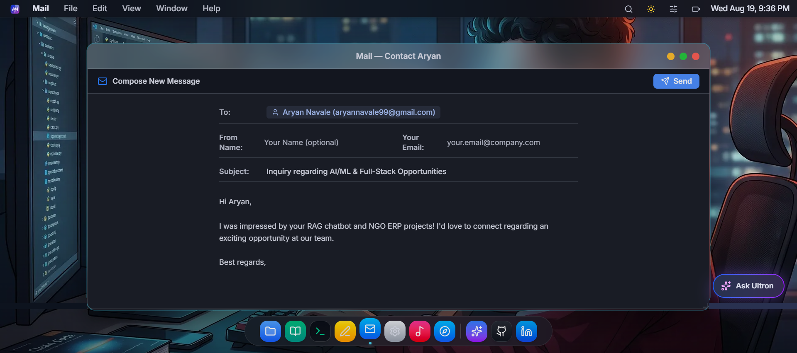
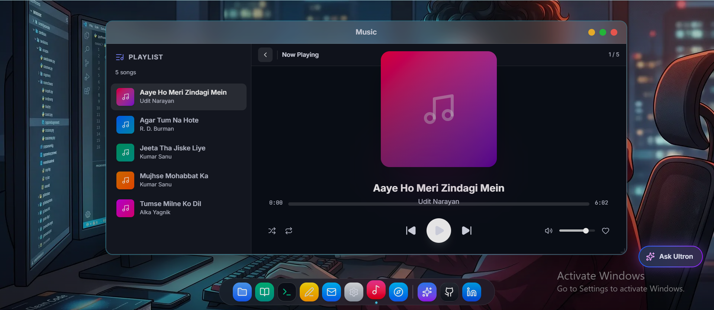
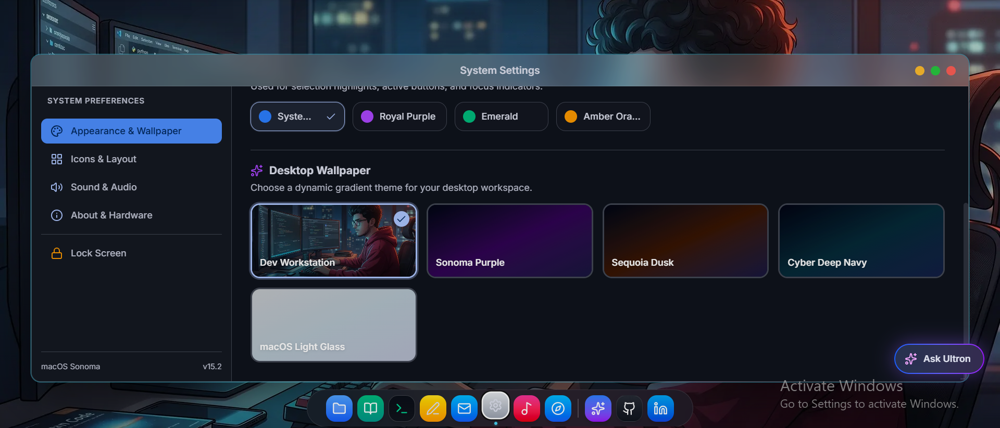
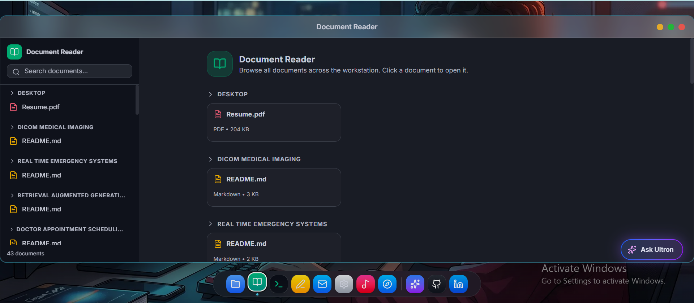
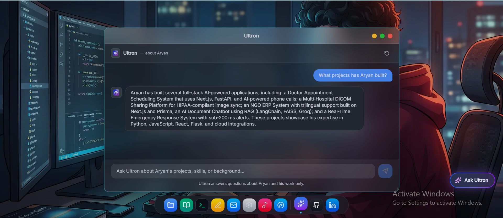
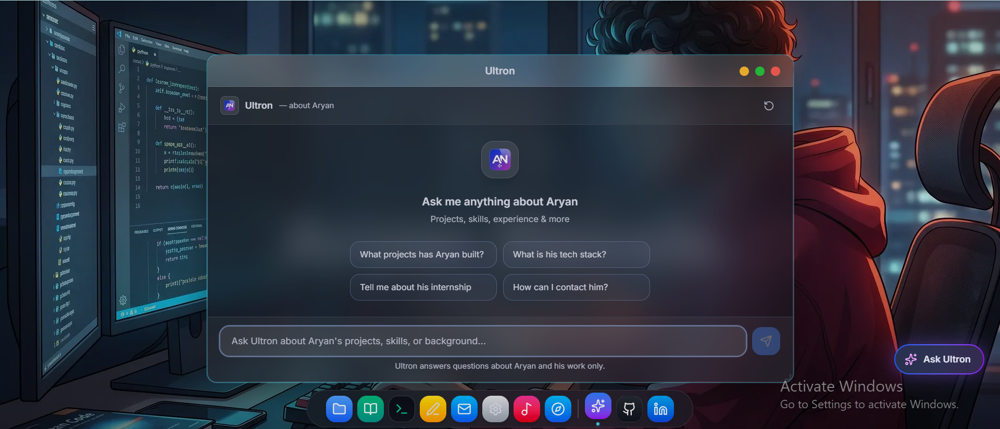

<div align="center">

# macOS Developer Portfolio

**An interactive macOS desktop simulation that doubles as a portfolio.**

Drag windows. Resize them. Open apps from the dock. Search with Spotlight.
Browse files in a real Finder. Chat with an AI assistant. It looks and feels
like a real operating system — because it *is* one, running entirely in your
browser.

<br/>

[](https://your-site.vercel.app)
[](https://nextjs.org)
[](https://www.typescriptlang.org)
[](https://tailwindcss.com)

</div>

---

## Screenshots

> Every screenshot shows a real, working window — not a mockup.

### Desktop



### Finder



### Terminal



### Safari



### Mail



### Music



### Notes


### Settings



### Document Reader



### AI Chat



### Agent



---

## What makes this different

Most portfolios are static pages with a list of projects. This one is a fully
interactive desktop environment that happens to showcase a developer's work.

**It started as a question:** *What if a portfolio felt like an actual product
instead of a PDF with links?* Every interaction — dragging a window, searching
with Spotlight, opening a file in Finder — is a chance for a visitor to stay a
little longer and discover something new.

### Key features

- **Draggable, resizable windows** — 8-direction resize, snap to edges, maximize/restore
- **macOS-style dock** with bounce animations and app labels
- **Spotlight search** (Cmd+K) — find apps, projects, and documents instantly
- **Finder** — a real file browser driven by the filesystem, not hardcoded data
- **Terminal** — a styled command palette showing project details
- **Safari** — open live project demos in an embedded browser
- **Mail** — send a real email to the developer through Resend
- **AI Chat** — ask questions about the developer's work, powered by Groq
- **Dark & light mode** — system-aware, toggleable from Settings
- **Responsive** — scales down to mobile with full-screen app views
- **Keyboard shortcuts** — Cmd+W to close, Cmd+M to minimize, Cmd+K for Spotlight

---

## Getting started

**Prerequisites:** [Node.js](https://nodejs.org) 18+

```bash
# Clone the repo
git clone https://github.com/aryannavale01/os-portfolio.git
cd os-portfolio

# Install dependencies
npm install

# Start the dev server
npm run dev
```

Open [http://localhost:3000](http://localhost:3000) and click around.

### Available commands

| Command              | What it does                                      |
| -------------------- | ------------------------------------------------- |
| `npm run dev`        | Start the development server                      |
| `npm run build`      | Production build (generates content first)        |
| `npm run start`      | Serve the production build locally                |
| `npm run lint`       | Run ESLint                                        |

---

## How it works

### Filesystem-driven content

Projects, documents, and research are all loaded from folders on disk — not
hardcoded in components. Drop a folder into `content/projects/` with a
`data.json` and a `README.md`, and it appears on the next build.

```
content/
├── projects/          ← Each folder = one project
│   ├── rag-chatbot/
│   │   ├── data.json
│   │   ├── README.md
│   │   └── 01-hero.png
│   └── ngo-erp/
├── documents/         ← PDFs that show up on the desktop
│   └── resume/
│       └── Aryan_Resume_2025.pdf
└── research/          ← Research notes and papers
    └── llm-fine-tuning/
        └── README.md
```

**Adding a project requires zero code changes.** The build script scans the
folders, validates the data, copies assets to `public/`, and generates the
TypeScript files that the UI reads at runtime.

### Window system

Every app runs inside a window that supports:
- Dragging from the title bar
- 8-direction resize handles
- Minimize, maximize, and close
- Focus management with z-index stacking
- Position and size persistence in localStorage

### Tech stack

| Layer        | Technology                                     |
| ------------ | ---------------------------------------------- |
| Framework    | Next.js 15 (App Router, standalone output)     |
| Language     | TypeScript (strict mode)                       |
| Styling      | Tailwind CSS 4                                 |
| Animation    | Motion (Framer Motion)                         |
| AI           | Groq API (Ask AI chat)                         |
| Email        | Resend (contact form)                          |
| Validation   | Zod (build-time data validation)               |
| Markdown     | react-markdown (README rendering)              |

---

## Environment variables

Set these in `.env.local` for local development, or in your hosting dashboard
for production.

| Variable          | Required | Purpose                                              |
| ----------------- | :------: | ---------------------------------------------------- |
| `GROQ_API_KEY`    | Yes      | Powers the "Ask AI" assistant ([console.groq.com](https://console.groq.com)) |
| `APP_URL`         | Yes      | Canonical URL for SEO and sitemap                    |
| `RESEND_API_KEY`  | No       | Enables the contact form email feature ([resend.com](https://resend.com)) |
| `RESEND_TO_EMAIL` | No       | Where contact emails are delivered (default: dev's email) |

---

## Deployment

The project deploys to Vercel with zero config — `vercel.json` is included.

1. Push to GitHub
2. Import the repo in [Vercel](https://vercel.com)
3. Add `GROQ_API_KEY` and `APP_URL` in the environment variables
4. Deploy

The content generators run automatically on every build via `prebuild` hooks.

---

## Project structure

```
├── app/                    Next.js App Router pages + API routes
│   ├── api/ask-ai/         Groq-powered AI chat endpoint
│   ├── api/send-email/     Resend email endpoint
│   ├── layout.tsx          Root layout, metadata, fonts
│   ├── page.tsx            Desktop shell
│   ├── robots.txt          Programmatic robots
│   └── sitemap.xml         Programmatic sitemap
├── components/
│   ├── Desktop.tsx         Main desktop — window state, dock, menu bar
│   ├── Window.tsx          Window chrome — drag, resize, traffic lights
│   ├── DesktopIntro.tsx    Welcome animation
│   ├── RotatingText.tsx    Typewriter text rotation
│   ├── apps/               Individual app components (Finder, Terminal, etc.)
│   └── seo/                Structured data components
├── content/                Filesystem-driven data
│   ├── aryan.ts            Developer profile and stats
│   ├── projects/           Project folders (data.json + README.md + assets)
│   ├── documents/          PDF documents
│   └── research/           Research notes and papers
├── hooks/                  Custom React hooks
├── lib/                    Utilities, animation configs, generated files
├── public/                 Static assets (images, project files)
└── types/                  TypeScript type definitions
```

---

## Author

**Aryan Navale** — AI & Data Science student building intelligent systems

[GitHub](https://github.com/aryannavale01) · [LinkedIn](https://linkedin.com/in/aryan-navale-207961291)

---

<div align="center">
<sub>Built with Next.js, TypeScript, and a lot of coffee.</sub>
</div>
